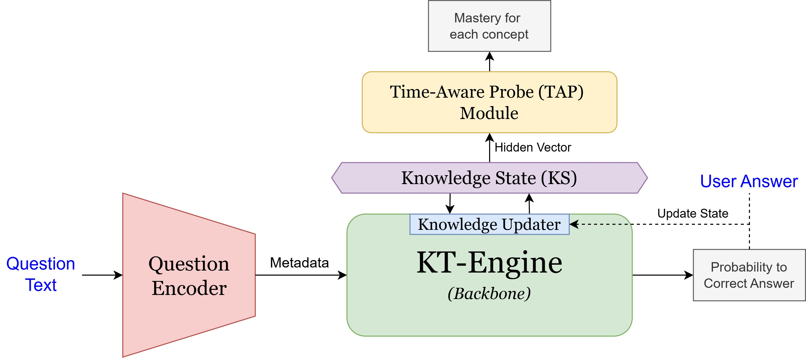
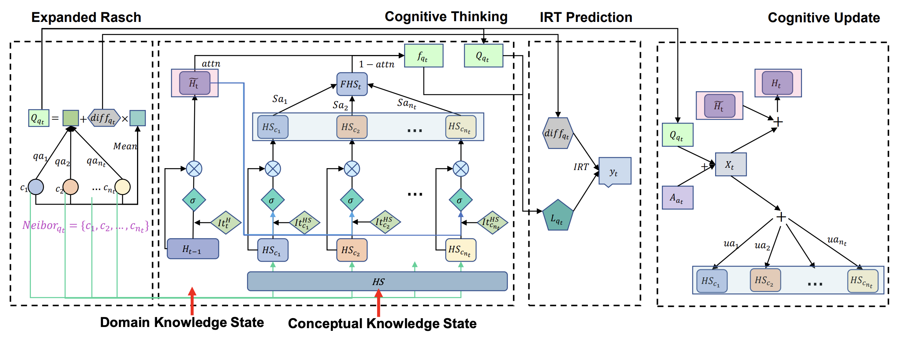
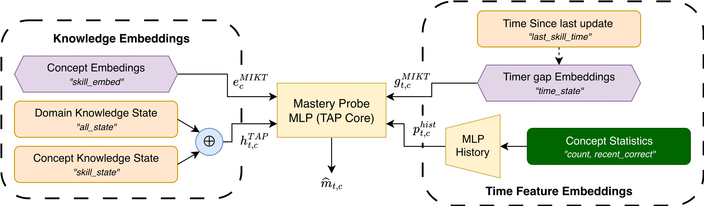
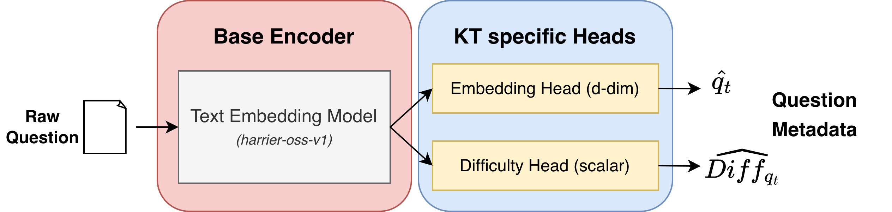

# 모델 아키텍처 설계 (Model Architecture Design)
## 0. Introduction

[Previous MobileKT Architecture (Scalar Hidden Mastery state)](https://www.notion.so/Previous-MobileKT-Architecture-Scalar-Hidden-Mastery-state-35e95612494780939e50c24b0c86cb31?pvs=21)

MobileKT는 모바일 디바이스에서 사용자의 지식 수준 상태를 각 개념별 Scalar값으로 추적하는 아키텍쳐이다. 기존에 설계한 아키텍쳐는 MIKT를 기반으로 스칼라(단일 차원)의 Knowledge State를 가질 수 있도록 하였다. 그러나 다른 KT모델 대비 성능이 많이 하락하였으며  특히 동일한 도메인에서 기존 MIKT가 보여주던 성능과 비교한 결과 급감(0.1 ~ 0.2 AUC 감소)하였다. 추가적으로 연구적으로 유의미한 아키텍쳐임을 증명하기에 근거가 부족하다는 문제점이 있다. 이에 기존 KT 모델의 아키텍쳐(다차원 Knowledge state)를 변경하지 않고 시간 반영 Mastery 해석 모듈(TAP)과 문항 인코더(Question Encoder)를 결합해 유용성 및 실용성을 높이고자 하였다. 기존 모델을 그대로 활용하기에 추론 능력은 보존되며 문항 인코더를 활용해 Question Domain의 제한성을 줄였고, 사용자가 각 개념에 대해 얼마나 숙달되었는지 명시적으로 제공해 학습 효율을 증대시킬 수 있다.

*Fig1. MobileKT Architecture Overview:*

## 1. Model Architecture

### 1-1. Baseline Model Selection Criteria

Mobile KT의 baseline(backbone)모델들 선정을 위한 다섯 가지 기준:

1. **Predictive strength**: MobileKT가 기존 강한 KT 모델과 비교했을 때 정답 예측 성능을 유지하거나 개선하는가? (기초적인 KT 성능 = Knowledge Concept State의 Hidden representation이 적합한가)
2. **Knowledge-state mastery**: 후보 모델의 knowledge state가 mastery 정보를 implicit 또는 explicit하게 담고 있으며, 그 정보를 concept별로 안정적으로 읽을 수 있는가?
3. **Mobile feasibility**: 기존 강한 KT 모델 대비 MobileKT가 온디바이스 inference, memory, update 비용에서 더 현실적인가?
4. **Content-aware extensibility**: quiz generator가 만든 새 문항에 대해 question/content embedding을 받아들이는 구조로 확장 가능한가?
5. **Multi-concept handling**: 하나의 문항이 여러 concept을 동시에 요구할 때, concept별 state 또는 mastery readout을 분리해서 읽고 업데이트할 수 있는가?

Multi-concept handling은 특히 중요하다. 실제 교육 문항은 단일 KC만 확인하는 경우도 있지만, 계산 절차, 개념 선택, 표현 변환, 응용 맥락이 함께 들어가는 경우가 많다. 예를 들어 한 문항이 비율 계산과 퍼센트 해석을 동시에 요구하거나, 면적 공식을 알고 도형 분해까지 해야 할 수 있다. 이때 baseline이 하나의 문항을 하나의 concept으로만 압축하면, 어떤 concept 때문에 학생이 틀렸는지 또는 어떤 concept state가 변해야 하는지 해석하기 어렵다.

따라서 MobileKT baseline은 단순히 $(q_t, c_t, r_t)$에서 $c_t$ 하나를 받는 모델보다, $(q_t, {\{c_1, ..., c_k}\}, r_t)$ 형태를 자연스럽게 처리하거나 최소한 multi-concept 문항을 합리적으로 encoding할 수 있어야 한다. 아래는 이 기준들에 적합한 핵심 4가지 모델에 대한 소개이다.

- **MIKT (Interpretable Knowledge Tracing with MultiscaleState Representation):**

| Criterion | Judgment | Detailed Reason |
| --- | --- | --- |
| Predictive Strength | Pass | WWW 2024 논문에서 MIKT는 ASSIST09, ASSIST12, EdNet, Eedi 등에서 strong/near-best 성능을 보고한다. MobileKT가 predictive strength를 주장하려면 MIKT보다 낮은 AUC를 보이면 구조적 주장이 약해진다. |
| Knowledge-State Mastery | Pass | 명시적 conceptual state matrix가 있어 TAP module 또는 linear/nonlinear mastery readout을 concept별로 붙이기 가장 쉽다. hidden vector 하나를 해석하는 DKT/AKT보다 MobileKT의 knowledge concept state 주장과 훨씬 직접적이다. |
| Mobile Feasibility | Partial | 파라미터 수 자체는 아주 크지 않고 per-student concept state도 명확하지만, local 구현은 forgetting, attention, update에서 full concept state를 반복적으로 훑는다. 따라서 MIKT가 Mobile에서 원활하게 동작하는지에 대해선 추가적인 검증이 필요하다. |
| Content-Aware Extensibility | Partial | Problem Embedding, Rasch/difficulty, question-to-skill mapping을 원문 문항이 있는 데이터셋을 활용해 content embedding으로 교체하거나 보강 가능하다. End-to-end 또는 2-Phase 중 선택적으로 학습 시킬 수 있다. |
| Multi-Concept Handling | Pass | 기존 `pro2skill` mapping을 통해 하나의 question이 여러 concept과 연결될 수 있고, target KC mask로 필요한 concept state를 읽는다. multi-concept readout/update 실험에서 MobileKT와 가장 직접적으로 비교 가능하다. |
- **ReKT (Revisiting Knowledge Tracing: A Simple and Powerful Model):**

| Criterion | Judgment | Detailed Reason |
| --- | --- | --- |
| Predictive Strength | Pass | ACM MM 2024 논문에서 ReKT는 question-based KT 기준 여러 dataset에서 best 또는 near-best 성능을 보고한다. 따라서 “가벼운 모델은 약하다”는 반론을 막는 데 중요한 역할을 한다. |
| Knowledge-State Mastery | Partial | question/skill/domain state가 명확히 분리되어 TAP probing 후보가 될 수 있다. 하지만 MIKT처럼 concept id마다 독립 state row가 지속되는 구조는 아니므로 concept별 mastery readout의 안정성은 추가 검증이 필요하다. |
| Mobile Feasibility | Pass | 논문은 FRU가 LSTM/Transformer core 대비 약 `38%` computing resources를 사용한다고 보고하며, local dummy runtime에서도 ReKT가 MIKT/QIKT보다 빠른 축에 속했다. 이는 ReKT를 lightweight/mobile feasibility baseline으로 두기에 적합한 근거가 된다. |
| Content-Aware Extensibility | Partial | question embedding과 skill embedding이 있어 content embedding으로 교체 가능하지만, 원 논문의 핵심은 content-aware representation이 아니라 simple powerful update architecture다. |
| Multi-Concept Handling | Partial | current skill을 gather-update하는 구조라 single current concept에는 잘 맞는다. multi-KC item에서는 여러 skill state를 aggregate하고 다시 분배하는 rule이 필요하므로, MobileKT의 native multi-concept update와는 차이가 난다. |
- **QIKT (Improving Interpretability of Deep Sequential Knowledge Tracing Models with
Question-centric Cognitive Representations):**

| Criterion | Judgment | Detailed Reason |
| --- | --- | --- |
| Predictive Strength | Pass | AAAI 2023 논문에서 QIKT는 DKT 대비 여러 dataset에서 AUC 개선을 보고했고, question-centric baseline으로 충분히 강하다. |
| Knowledge-State Mastery | Partial | concept-level prediction head가 있어 concept signal을 읽을 수는 있다. 그러나 student별 persistent concept state를 유지하는 구조가 아니라 LSTM hidden representation을 decoding하는 방식이므로 mastery stability는 MIKT/ReKT보다 약하다. |
| Mobile Feasibility | Weak | local 구현은 question LSTM과 concept LSTM을 모두 사용하고, 특히 `out_question_all`의 output dimension이 `num_q`에 비례한다. question 수가 커지면 parameter/runtime cost가 mobile baseline으로 부담스럽다. |
| Content-Aware Extensibility | Pass | question-specific representation을 핵심으로 삼고, 구현도 `QueEmb`와 pretrained embedding path를 통해 question embedding을 바꿀 여지가 있다. MobileKT의 quiz generator/new question claim을 방어하는 데 가장 직접적이다. |
| Multi-Concept Handling | Partial | 구현상 multi-KC concept output은 average fusion으로 처리할 수 있다. 다만 concept별 state를 따로 업데이트하고 credit assignment를 분리하는 구조는 아니다. |
- **KCQRL (Automated Knowledge Concept Annotation and Question Representation
Learning for Knowledge Tracing) Framework:**
    
    KCQRL 같은 경우 새로운 KT 모델이 아닌, 기존 연구에 LLM을 활용하여 KC annotation 및 Solution step을 제시하고, Encoder를 활용해 Question Embedding을 제공하는 Framework를 제시하였다. 이는 MobileKT의 Question Generation 및 Question Encoder의 구조 설계에 참고 가능하며 특히 KCQRL의 Encoder 부분을 아키텍쳐적으로 분석해 본 연구에서도 이를 기반으로 설계해 검증할 수 있다.
    

*Fig2. MIKT Model Architecture:*

결론적으로, 본 연구에 있어 가장 좋은 Backbone Engine은 MIKT라고 볼 수 있다. 특히 User Experience 측면에서 보았을때 실용성을 직접적으로 드러내는 Concept별 Mastery를 추출하기에 최적의 모델 구조를 가지고 있다. 또한 문항과 관련된 Multi-Concept를 그 자체로 활용할 수 있어 다양한 Concept 조합에도 유연하게 대처하며 Question Embedding을 활용하는 아키텍쳐이므로 Question Encoder와의 접목도 원활할 것으로 예상된다.

*베이스라인 모델선정을 위한 비교 분석 문서 (Appendix):*

[MobileKT Baseline Criteria Audit](https://www.notion.so/MobileKT-Baseline-Criteria-Audit-35f9561249478028b6f9ecf3edfb9fda?pvs=21)

### 1-2. TAP(Time-Aware Probe) Module

TAP(Time-Aware Probe)는 MobileKT에서 사용자의 지식 수준을 직접 업데이트하는 backbone이 아니라, 이미 학습된 KT backbone의 latent Knowledge State를 concept별 mastery score로 읽어내는 해석 모듈이다. 기존 scalar-state MobileKT 설계에서는 모델 내부 state 자체를 처음부터 $[0, 1]$ 범위의 mastery 값으로 두었기 때문에 해석은 쉬웠지만, MIKT 대비 예측 성능이 크게 하락하였다. 반대로 MIKT는 강한 prediction 성능과 concept-specific state matrix를 제공하지만, 각 concept state vector가 학생의 실제 숙련도를 몇 퍼센트로 의미하는지는 바로 알기 어렵다. TAP은 이 두 문제 사이의 절충안으로, **MIKT의 다차원 Knowledge State는 그대로 유지하면서 그 안에 담긴 mastery 정보를 post-hoc readout으로 추출**하는 역할을 한다.

즉 본 연구에서 TAP이 답하려는 질문은 다음과 같다.

$$
\text{Does the frozen KT knowledge state contain decodable concept-level mastery information?}
$$

*Fig3. TAP-module Diagram:*

이를 위해 pretrained MIKT backbone은 freeze하고, TAP의 작은 readout network만 별도로 학습한다. 이 설계는 backbone의 prediction 능력을 훼손하지 않으면서, hidden state 안에 concept별 숙련도 정보가 얼마나 안정적으로 담겨 있는지를 검증할 수 있게 한다.

$$
\text{Frozen MIKT State}_{t}(c)
+ \text{Frozen MIKT Concept Representation}_{c}
+ \text{Time-aware History Representation}_{t}(c)
\rightarrow \text{TAP}
\rightarrow {Mastery}_{t}(c)
$$

여기서 ${Mastery}_{t}(c)$는 심리학적으로 관측된 절대적인 "true mastery"가 아니라, KT state로부터 읽어낸 **operational mastery readout**이다. 즉 "학생이 이 concept을 본질적으로 얼마나 이해했는가"를 직접 관측할 수 없기 때문에, 본 연구에서는 가까운 미래의 same-concept correctness를 기반으로 supervision label을 구성하고, 그 label을 잘 예측하는 calibrated concept-level readout을 mastery로 해석한다.

MIKT 기반 TAP에서는 concept별 state가 비교적 자연스럽게 정의된다. MIKT는 각 concept에 대응되는 `skill_state` matrix를 유지하고, 동시에 학생의 전체 학습 상태를 나타내는 `all_state`를 가진다. 각 concept $c$에 대해 다음처럼 concept-aligned dynamic state를 구성한다.

$$
h_{t,c}^{TAP} = [all\_state_t; skill\_state_t(c)]
$$

이 구조는 단일 global hidden vector만 사용하는 DKT류 모델보다 MobileKT의 mastery readout 주장에 더 적합하다. 특정 concept $c$에 대응되는 latent state row가 존재하기 때문에, TAP은 "global sequence summary에서 concept을 억지로 분리"하는 것이 아니라, MIKT가 유지하는 concept-specific state를 직접 읽는다.

여기서 `skill_state_t(c)`와 `skill_embed(c)`는 구분해야 한다. `skill_state_t(c)`는 학생의 interaction history에 따라 변화하는 동적 Knowledge State이고, `skill_embed(c)`는 MIKT backbone이 학습한 concept별 정적 embedding이다. 초기 TAP pilot은 별도의 TAP 전용 concept embedding table을 추가로 학습했지만, 최종 설계에서는 이를 제거한다. TAP이 독립적인 predictor처럼 concept별 prior를 새로 암기하기보다, MIKT가 이미 학습한 representation space를 재사용하도록 하기 위함이다.

$$
e_c^{MIKT} = skill\_embed(c)
$$

Timer 정보도 raw scalar를 그대로 최종 MLP에 전달하지 않고, MIKT의 표현 공간과 동일한 차원의 vector로 변환한다. ReKT와 MIKT는 elapsed gap을 단순 scalar로만 사용하지 않고, $d$차원의 learned time embedding으로 변환한 뒤 state vector와 결합한다. MobileKT의 MIKT backbone에도 다음과 같은 학습 가능한 `time_state` table이 존재한다.

$$
time\_state \in \mathbb{R}^{(max\_seq\_len + 1) \times d}
$$

기본 설정에서는 $max\_seq\_len=200$, $d=64$이므로 `time_state`의 shape은 $[201, 64]$이다. 각 row는 학생별 기록이 아니라, 모든 학생이 공유하는 elapsed interaction-step bucket의 embedding이다. 학생별로 마지막 concept 관측 시점을 저장한 `last_skill_time[c]`를 이용하여 gap을 계산하고, 200 step 이상은 마지막 bucket으로 clamp한다.

$$
gap_{t,c}
= clamp(t - last\_skill\_time(c), 0, 200)
$$

$$
g_{t,c}^{MIKT} = time\_state[gap_{t,c}]
$$

MIKT가 이미 학습한 time representation을 TAP에서도 frozen 상태로 재사용한다. 반면 `seen_count`와 `recent_correct_rate`는 기존 MIKT에 직접 포함되지 않은 practice-history 정보이므로, TAP 내부의 작은 history encoder로 변환한다.

| History Feature | Meaning |
| --- | --- |
| $\log(1 + count_{t,c})$ | 지금까지 concept $c$가 관측된 횟수 |
| $recent\_correct_{t,c}$ | 최근 window 안에서 concept $c$를 맞힌 비율 |

$$
p_{t,c}^{hist}
= MLP_{history}([\log(1 + count_{t,c}); recent\_correct_{t,c}])
$$

최종 TAP의 기본 입력은 아래와 같다.

$$
z_{t,c}^{TAP}
= [h_{t,c}^{TAP}; e_c^{MIKT}; g_{t,c}^{MIKT}; p_{t,c}^{hist}]
$$

중요한 점은 모든 history feature가 반드시 **past-only**여야 한다는 것이다. TAP이 미래 correctness를 label로 사용하기 때문에, feature에 미래 interaction 정보가 들어가면 leakage가 발생한다. 따라서 모든 입력은 시점 $t$까지의 interaction만으로 계산한다.

TAP 학습을 위한 label은 직접 주어진 mastery annotation이 아니라 future same-concept correctness로 만든다. 시점 $t$에서 concept $c$에 대한 label은 horizon $H$ 안에서 같은 concept $c$가 다시 등장했을 때의 정답 여부를 평균한 값이다. 기본 setting에서는 가까운 미래 interaction에 더 큰 weight를 주기 위해 exponential decay average를 사용한다.

$$
y_{t,c}^{TAP}
= \frac{\sum_{j=t+1}^{t+H} \mathbb{1}[c \in C_j]\exp(-(j-t)/\tau)r_j}
{\sum_{j=t+1}^{t+H} \mathbb{1}[c \in C_j]\exp(-(j-t)/\tau)}
$$

여기서 $r_j$는 학생이 시점 $j$에서 정답을 맞혔는지 나타내는 binary response이다. 이 label은 "현재 concept mastery가 높으면 가까운 미래에 같은 concept 문제를 맞힐 가능성이 높다"는 operational definition에 기반한다. 따라서 TAP 출력은 엄밀히 말하면 다음 값에 가깝다.

$$
{Mastery}_{t}(c)
\approx P(\text{future correct on concept } c \mid \text{KT state at } t)
$$

같은 concept이 horizon 안에 다시 등장하지 않는 경우는 label을 0으로 두지 않는다. 이는 "학생이 틀렸다"는 의미가 아니라 "관측되지 않았다"는 의미이므로, 해당 sample은 mask out한다. 이 처리는 TAP이 unobserved concept을 incorrect로 오해하지 않도록 하기 위한 핵심 설계이다.

최종 TAP은 작은 MLP readout으로 정의한다. long gap은 forgetting과 관련이 있지만, 실제 데이터에서 long-gap bucket에는 이미 숙련도가 높은 concept도 함께 섞인다. 따라서 gap이 증가하면 mastery가 항상 감소하도록 강제하지 않고, frozen MIKT가 학습한 time representation과 practice history를 이용하여 데이터로부터 readout을 학습한다.

$$
\widehat{m}_{t,c}
= \sigma(MLP_{readout}(z_{t,c}^{TAP}))
$$

TAP readout의 capacity는 의도적으로 작게 유지한다. TAP의 목적은 별도의 predictor를 추가하는 것이 아니라, frozen MIKT state에 담긴 정보를 해석 가능한 mastery score로 읽는 것이기 때문이다. MIKT의 prediction-time concept attention은 문제별 relevance를 확인하기 위한 진단 정보로 분리하고, TAP mastery와 합성하지 않는다.

학습 objective는 future same-concept label에 대한 soft binary cross entropy를 기본으로 한다.

$$
L_{future}
= BCE(\widehat{m}_{t,c}, y_{t,c}^{TAP})
$$

따라서 TAP의 전체 목적은 단순히 MIKT의 최종 prediction을 복제하는 것이 아니다. TAP은 frozen backbone state에서 concept-level mastery를 읽는 모듈이며, 그 mastery가 future same-concept correctness와 calibration 측면에서 의미 있는지를 검증한다.

$$
L_{TAP} = L_{future}
$$

최종적으로 본 연구에서 TAP은 다음 역할을 담당한다.

| Role | Description |
| --- | --- |
| Interpretability | 다차원 KT state를 concept별 scalar mastery로 변환 |
| Calibration | mastery score가 future correctness probability로 해석 가능한지 검증 |
| Time awareness | elapsed gap, seen count, recent correctness를 반영해 forgetting-sensitive readout 제공 |
| Backbone diagnosis | MIKT/ReKT 등 backbone state가 mastery 정보를 얼마나 담는지 비교 |
| Mobile UX | on-device 학습 앱에서 concept별 숙련도와 약점 진단을 제공 |

따라서 TAP은 MobileKT에서 부가적인 visualization head가 아니라, "strong KT model의 prediction 성능을 유지하면서도 학생에게 설명 가능한 concept-level knowledge state를 제공할 수 있는가"를 검증하는 핵심 모듈이다.

*TAP 관련 세부 연구문서 (Appendix):*
[Time-Aware Probing Module for Interpretable Knowledge Tracing](https://www.notion.so/Time-Aware-Probing-Module-for-Interpretable-Knowledge-Tracing-35a95612494780818875e903c3b5b878?pvs=21)

### 1-3. Question Encoder

기존 MIKT 및 다수의 KT 선행 연구는 Question ID를 축으로 하는 Embedding Table을 활용한다. 모델은 학습 과정에서 각 Question ID에 대응되는 Question Embedding Vector($q_t$)와 internal difficulty parameter($Diff_{q_t}$)를 자동으로 최적화하고, 이를 기반으로 학생의 Knowledge State를 업데이트한다. 이 방식은 train/test에 동일한 Question ID가 존재하는 일반적인 KT benchmark setting에서는 효과적이지만, MobileKT가 목표로 하는 generated question 또는 unseen question setting에서는 한계가 분명하다. 새 문항은 기존 embedding table에 row가 없기 때문에 MIKT가 바로 이해할 수 있는 item representation을 제공하기 어렵다.

따라서 본 연구에서 Question Encoder는 독립적인 KT 모델이 아니라, **Raw Question Metadata를 MIKT-compatible latent representation으로 변환하는 adapter**로 정의한다. 즉 MIKT의 multi-concept update 구조, `pro2skill` mapping, Knowledge State representation은 최대한 그대로 유지하고, 기존 Question ID embedding lookup만 content-based prediction으로 대체한다. Question Encoder의 핵심 목표는 raw question으로부터 MIKT가 기존 embedding table에서 사용하던 $(q_t, Diff_{q_t})$를 근사하는 것이다.

$$
QuestionEncoder(q_{t}^{raw}) \rightarrow (\hat{q_t}, \widehat{Diff}_{q_t})
$$

여기서 $x_q$는 단일 MCQ 문항을 표현하는 structured text input이다. 본 연구에서는 Question Encoder의 입력을 과도하게 복잡하게 만들기보다, Quiz Generation에서 실제로 생성할 문항 형식과 맞추기 위해 **Question Text, Options, Optional Visual Description** 세 가지로 제한한다. 전체 Question Encoder 아키텍쳐는 아래와 같다.

*Fig2. Question Encoder Architecture:*

Encoder에 들어가는 핵심 모델은 Microsoft에서 공개한 `harrier-oss-v1-0.6b` 모델을 활용했으며, 이는 본 프로젝트의 다른 연구 파트인 Concept Profiler에서 선행하여 활용되었다. 본 연구에서는 해당 모델의 출력 레이어에 2개의 KT-specific task head를 붙여 최종적인 모델링을 한다. Embedding Head는 MIKT의 question embedding table에 대응되는 d차원 vector $\hat{q_t}$를 출력하고, Difficulty Head는 MIKT의 internal difficulty parameter에 대응되는 scalar $\widehat{Diff}_{q_t}$를 출력한다.

여기서 Difficulty Head가 예측하는 $\widehat{Diff}_{q_t}$는 Bloom-style difficulty가 아니다. MIKT의 $Diff_{q_t}$는 KT objective를 통해 학습된 internal latent parameter이며, MIKT의 Expanded Rasch-style item representation을 유지하려면 Question Encoder가 이 값까지 함께 근사해야 한다. 반면 본 프로젝트의 Quiz Generation 단계에서 사용하는 난이도는 Bloom's taxonomy 기반의 cognitive difficulty level에 가깝다. Statics 2011은 문항별 explicit Bloom-level annotation을 제공하지 않기 때문에 Bloom-style difficulty는 Question Encoder의 supervised target이나 training feature로 사용하지 않고, Quiz Generation 단계에서만 문항 생성 조건으로 활용한다.

Question Encoder는 서버 또는 authoring-time module로 동작하는 것을 기본 가정으로 한다. `harrier-oss-v1-0.6b`는 모바일 기기에서 매 interaction마다 실시간으로 실행하기에는 비용이 크기 때문에, raw/generated question이 생성되거나 문제 bank에 등록되는 시점에 $(\hat{q_t}, \widehat{Diff}_{q_t})$를 미리 계산한다. 모바일 디바이스에서는 계산된 question embedding, MIKT-compatible difficulty, question-to-skill mapping, 학생의 interaction history를 기반으로 KT-Engine을 실행한다. Bloom-style difficulty는 KT-Engine의 입력이라기보다, 어떤 concept에 대해 어떤 cognitive level의 quiz를 생성할지 결정하는 Quiz Generation control variable로 사용한다.

$$
\text{Server / Authoring Time: } RawQuestion \rightarrow QuestionEncoder \rightarrow (\hat{q_t}, \widehat{Diff}_{q_t})
$$

$$
\text{On-device: } (\hat{q_t}, \widehat{Diff}_{q_t}, KC\ mapping, student\ history) \rightarrow MIKT\ Engine
$$

Knowledge Tracing 분야의 데이터셋은 크게 (Question ID, Question Related Concepts/skills, Responses 등)으로 이루어져 있다. 원본 문항에 대한 데이터셋이 부족한 경우가 많으며 실제 조사한 결과를 아래 표로 나타내면 다음과 같다.

| **Dataset** | **# of Interactions** | **Question Text Inclusion** | **Language** | **Feature & Limitations** |
| --- | --- | --- | --- | --- |
| **ASSISTments (09~17)** | 수십만 ~ 수백만 | X | 영어 | KT 연구의 80% 이상에서 쓰이는 표준 벤치마크이나 문항 ID만 존재함. |
| **EdNet** | 1억 3,100만 | X | 한국어(기반) | 세계 최대 규모의 데이터셋이지만 텍스트 정보는 모두 비식별화됨. |
| **Junyi Academy** | 1,600만 | X | 중국어 | 대만의 교육 플랫폼 데이터. ID와 정답 여부(0/1)만 제공됨. |
| **KDDCup 2010** | 수천만 | X | 영어 | 수학 문제 풀이 데이터. 스텝별 상세 로그는 있으나 원문은 없음. |
| **Eedi** | 2,000만 | △ | 영어 | 다중 선택형 수학 문제. 일부 텍스트와 이미지 형태의 문항이 섞여 있음. |
| **XES3G5M** | 550만 | O | 중국어 | 문항 텍스트와 지식 개념 텍스트는 제공하나, 학생의 구체적 오답은 없음. |
| **SQKT (2025)** | 비공개 | O | 영어 | 프로그래밍(코딩) 특화. 문제 지문, 학생의 코드 제출 이력 및 질문 텍스트 포함. |
| **FoundationalASSIST (2026)** | 170만 | O | 영어 | 원본 문항, 오답 보기(Distractor), 학생의 실제 텍스트 응답까지 복원된 최신 데이터. |
| **Statics 2011** | 약 33만 건 | O | 영어 | 대학 공학 도메인. 하나의 문제를 여러 하위 스텝(Sub-step)으로 쪼개어 푸는 세밀한 인지 과정이 기록됨. |

위의 테이블을 근거로 본 연구에서는 영어를 활용하며, 대학생의 입장에서 가장 실용성이 높은 데이터셋인 Statics 2011을 Domain으로 설정하였다. FoundationalASSIST의 경우 미국 6~8학년의 수학 문항들에 대한 정보들을 가지고 있어 Statics2011 대비 전문성이 떨어지며 SQKT의 경우 코딩에 특화되어 도메인의 포괄성이 조금 떨어진다는 단점이 있다.

Statics 2011은 단순한 Question Text만 제공하는 데이터셋이 아니라, problem prompt, sub-question, input type, 선택지, 정답 범위, image resource, F2011 KC mapping, student step-level response가 함께 제공된다. 현재 정리된 `problem_list.jsonl` 기준으로 227개 problem, 827개 question, 1046개 input을 사용할 수 있으며, 이는 `student_step` 로그의 약 91% 이상을 커버한다. 이 중 Question Encoder의 main input으로 직접 사용하는 정보는 문항 지문, 선택지, 그리고 visual content를 텍스트로 변환한 description이다.

Question Encoder의 입력 schema는 아래와 같이 통일한다.

- **Question:** 단일 MCQ 문항의 지문. Statics 2011에서 sub-question prompt가 너무 짧은 경우에는 해당 문항이 독립적으로 읽히도록 필요한 stem만 함께 결합한다.
- **Options:** MCQ 선택지. Statics 2011의 `multiple_choice`와 `select` input을 우선 활용하고, numeric/hotspot/short_answer는 이후 확장 실험으로 분리한다.
- **Visual Description (Optional):** Statics 2011의 diagram/image를 text caption으로 변환한 설명. Quiz Generation에서 생성되는 text-only MCQ에서는 이 field를 비워 둔다.

Visual Description은 Statics 2011이 diagram-dependent 문항을 많이 포함하기 때문에 추가한 optional field이다. 실제 MobileKT Quiz Generation에서는 기본적으로 text-only MCQ를 생성하므로, generated question에는 Visual Description이 없을 수 있다. 따라서 학습 과정에서는 visual description dropout을 적용하여, 모델이 visual caption에 과도하게 의존하지 않고 Question과 Options만으로도 안정적인 $\hat{q_t}$를 생성할 수 있도록 한다.

Concept 정보는 Question Encoder의 직접 입력이라기보다 MIKT side information으로 분리한다. Quiz Generation 단계에서 어떤 concept으로 문항을 만들지 이미 결정되므로, concept 정보는 MIKT의 question-to-skill mapping(`pro2skill`, q-matrix equivalent)에 사용한다. Bloom-style difficulty는 Statics 2011에 supervision label이 없기 때문에 Question Encoder 학습과 입력 구성에서는 사용하지 않는다.

Question Encoder 학습에 관한 방법론은 아래 두 가지로 나눌 수 있다.

1. **End-to-End (Question Encoder → MIKT) Training:** 기존 MIKT Backbone과 Question Encoder를 결합하여 한 번에 학습하는 구조이다. 두 모듈을 처음부터 동시에 학습하는 방법과, MIKT 사전 학습 후 Question Encoder를 붙여 전체를 재학습하는 방법으로 나뉠 수 있다. 이 방법은 downstream KT objective에 직접 최적화된다는 장점이 있지만, MIKT backbone까지 함께 변한다는 특징이 있다.
2. **MIKT First, Question Encoder after Training:** MIKT를 먼저 학습시킨 후, 기존 embedding table의 `(Question ID, Question Embedding, Internal Difficulty)` 정보를 target으로 삼아 Question Encoder를 따로 학습한다. 이 방법은 Question Encoder를 MIKT 내부 표현 공간으로 보내는 distillation 문제로 정의될 수 있다.

본 연구에서는 두 학습 전략을 모두 실험적으로 비교한다. MIKT First 방식은 Question Encoder가 기존 MIKT의 item representation을 얼마나 잘 복원하는지 확인하는 안정적인 distillation setting이며, End-to-End 방식은 Question Encoder와 KT objective를 직접 연결했을 때 모델이 더 깊어지지만 downstream prediction 성능이 기존 대비 잘 유지되는지 확인하기 위한 setting이다. 따라서 두 방법은 우열을 사전에 가정하지 않고, seen/unseen question split에서 AUC, BCE, q/diff reconstruction quality, calibration을 기준으로 비교한다.

Training objective는 학습 전략에 따라 다르게 정의한다. 두 전략은 같은 Question Encoder를 사용하지만, 검증하려는 연구 질문이 다르기 때문이다. MIKT First 방식은 raw question content가 기존 MIKT의 item representation을 얼마나 잘 복원할 수 있는지 확인하는 것이 핵심이고, End-to-End 방식은 Question Encoder가 downstream KT prediction에 직접적으로 유용한 representation을 학습할 수 있는지 확인하는 것이 핵심이다.

실제 구현에서 사용하는 loss term은 아래와 같다. 여기서 $\mathcal{I}$는 padding이 아닌 question position의 집합, $\mathcal{P}$는 다음 응답을 예측할 수 있는 valid prediction position의 집합이다. Question embedding dimension은 $d_q = 64$이다.

- **Question embedding reconstruction loss**

$$
L_q
=
\frac{1}{|\mathcal{I}|d_q}
\sum_{(b,t)\in\mathcal{I}}
\left\|
\hat{q}_{b,t} - q^{teacher}_{b,t}
\right\|_2^2
$$

$\hat{q}_{b,t}$는 Question Encoder가 생성한 question embedding이고, $q^{teacher}_{b,t}$는 기존 MIKT teacher의 question ID embedding table에서 조회한 embedding이다. 실제 구현에서는 element-wise **MSE loss**를 사용한다. Cosine similarity는 학습 loss로 사용하지 않으며, embedding 방향이 얼마나 유사한지 확인하기 위한 evaluation metric으로만 기록한다.

- **Difficulty reconstruction loss**

$$
L_{diff}
=
\frac{1}{|\mathcal{I}|}
\sum_{(b,t)\in\mathcal{I}}
\left(
\widehat{Diff}_{b,t} - Diff^{teacher}_{b,t}
\right)^2
$$

$\widehat{Diff}_{b,t}$는 Question Encoder의 difficulty head가 생성한 scalar이고, $Diff^{teacher}_{b,t}$는 기존 MIKT teacher가 question ID별로 학습한 scalar difficulty parameter이다. 실제 regression loss는 **MSE loss**이다. 이 값은 Bloom taxonomy level이나 정답 확률이 아니라, MIKT 내부에서 사용하는 unbounded latent difficulty scalar이다.

- **Prediction logit distillation loss**

$$
L_{logit}
=
\frac{1}{|\mathcal{P}|}
\sum_{(b,t)\in\mathcal{P}}
\left(
z^{student}_{b,t} - z^{teacher}_{b,t}
\right)^2
$$

$$
z
=
\operatorname{logit}
\left(
\operatorname{clamp}(p, \epsilon, 1-\epsilon)
\right)
$$

$p^{student}$는 Question Encoder 기반 MIKT student가 출력한 다음 응답 정답 확률이고, $p^{teacher}$는 기존 question ID 기반 MIKT teacher의 정답 확률이다. 실제 구현에서는 두 확률을 numerical stability를 위해 clamp한 뒤 logit으로 변환하고, valid prediction position에서 **MSE loss**를 계산한다. 즉, probability 간 MSE나 KL divergence를 사용하는 것이 아니다.

- **Knowledge Tracing response loss**

$$
L_{KT}
=
-\frac{1}{|\mathcal{P}|}
\sum_{(b,t)\in\mathcal{P}}
\left[
r_{b,t+1}\log p^{student}_{b,t}
+
(1-r_{b,t+1})\log(1-p^{student}_{b,t})
\right]
$$

$L_{KT}$는 Question Encoder 기반 MIKT student의 prediction과 실제 다음 student response 사이에서 계산하는 masked **binary cross entropy (BCE) loss**이다.

**MIKT First, Question Encoder after Training**에서는 pretrained MIKT를 teacher로 고정하고, Question Encoder만 학습한다. 이 setting에서 $L_q$와 $L_{diff}$는 auxiliary loss가 아니라 main objective이다. 즉 Question Encoder는 raw question으로부터 기존 MIKT가 Question ID lookup table에서 사용하던 $(q_t, Diff_{q_t})$를 복원하도록 학습된다.

$$
L_{QE}^{distill} = \lambda_1 L_q + \lambda_2 L_{diff}
$$

Teacher MIKT와의 prediction compatibility까지 보존하기 위해 $L_{logit}$을 추가할 수 있다.

$$
L_{QE}^{distill+logit} = \lambda_1 L_q + \lambda_2 L_{diff} + \lambda_3 L_{logit}
$$

이때 MIKT backbone은 freeze하는 것을 원칙으로 한다. 그렇지 않으면 Question Encoder가 MIKT의 기존 latent space를 복원하는지, 아니면 MIKT 자체가 새로운 representation에 맞게 변하는지 구분하기 어렵다.

**End-to-End (Question Encoder → MIKT) Training**에서는 Question Encoder와 MIKT student backbone을 함께 업데이트한다. Pretrained MIKT teacher는 frozen 상태로 유지하며, 실제 KT prediction 성능을 직접 최적화하기 위해 $L_{KT}$를 추가한다.

$$
L_{QE}^{e2e}
=
\lambda_1 L_q
+
\lambda_2 L_{diff}
+
\lambda_3 L_{logit}
+
\lambda_4 L_{KT}
$$

현재 MobileKT export에 반영된 최종 모델은 **QE-E2E+Teacher** setting이다. 실제 학습에서는 $\lambda_1=\lambda_2=\lambda_3=\lambda_4=1.0$을 사용했으므로 최종 objective는 아래와 같다.

$$
L_{QE\text{-}E2E+Teacher}
=
L_q + L_{diff} + L_{logit} + L_{KT}
$$

이 접근은 Question Encoder embedding이 기존 ID embedding을 단순 복제하는 데 머무르지 않고, 실제 response prediction에 필요한 방향으로 함께 조정되도록 한다. 학습 결과를 분석할 때 기록하는 question embedding cosine similarity와 difficulty Pearson correlation은 evaluation metric이며, optimization objective에는 포함하지 않는다.

학습 과정에서 MIKT의 multi-concept handling은 기존 `pro2skill` 또는 q-matrix mapping에 맡기며, Question Encoder는 concept weight를 새로 예측하지 않는다. generated question에서는 Quiz Generator가 어떤 concept으로 문항을 만들지 사전에 결정하므로, KC mapping은 해당 generation metadata 또는 Concept Profiler 결과를 그대로 사용한다.

Question Encoder의 유효성은 단순 random split보다 unseen question/generalization setting에서 검증되어야 한다. Main experiment는 "기존 MIKT의 Question ID lookup을 content-based Question Encoder로 대체했을 때 unseen/generated question에서도 성능을 유지할 수 있는가"를 확인하는 데 집중한다. 따라서 지나치게 당연한 lower-bound나 debugging용 setting은 main table에서 제외하고, 핵심 비교군만 남긴다.

| Experiment | Purpose |
| --- | --- |
| `MIKT-ID` | 기존 Question ID embedding table을 사용하는 teacher/upper-bound setting |
| `MIKT-Mean` | unseen question에 평균 $q_t$를 넣는 cold-start baseline |
| `MIKT-FrozenText` | frozen text encoder embedding에 linear projection만 붙인 baseline |
| `QE-Distill-q+diff` | frozen MIKT 위에서 $\hat{q_t}$와 $\widehat{Diff}_{q_t}$를 함께 복원하는 main distillation setting |
| `QE-Distill+Logit` | $L_q + L_{diff}$에 teacher logit distillation을 추가한 setting |
| `QE-Joint` | distillation으로 초기화한 뒤 MIKT 일부 또는 전체를 unfreeze하여 $L_{KT}$ 중심으로 fine-tuning하는 setting |
| `QE-Scratch-E2E` | Question Encoder와 MIKT를 처음부터 함께 학습하는 end-to-end setting |

Evaluation split은 seen-question split뿐 아니라 unseen-question, unseen-problem, unseen-KC-combination split을 포함해야 한다. 평가 지표로는 KT prediction AUC/ACC/RMSE/BCE뿐 아니라, $\hat{q_t}$와 teacher $q_t$의 cosine similarity, $\widehat{Diff}_{q_t}$와 teacher $Diff_{q_t}$의 Pearson/Spearman correlation, teacher-student logit difference를 함께 확인한다. Bloom-style difficulty는 Question Encoder 학습 및 평가에서는 제외하고, 추후 Quiz Generation policy를 설계할 때 별도 항목으로 다룬다.

### 1-4. Current Experimental Results

현재까지의 실험은 크게 네 단계로 정리할 수 있다. 첫째, Statics 2011에서 어떤 KT backbone이 구조적으로 적합한지 확인하기 위한 pyKT baseline 재현 실험을 수행했다. 둘째, MobileKT v4 backbone 위에서 기존 ID embedding table과 Harrier 기반 Question Encoder를 비교했다. 셋째, ID 기반 MIKT teacher를 활용한 Question Encoder distillation 및 teacher-guided end-to-end 학습을 검증했다. 넷째, 최종 frozen MobileKT v4 backbone 위에 TAP-v2 mastery readout을 학습하고 모바일 export 가능성을 확인했다.

#### 1-4-1. Statics 2011 KT Baseline

먼저 Statics 2011의 `statics2011_kc` setting에서 여러 KT baseline을 같은 fold/seed protocol로 재현했다. 이 setting은 633 question, 85 atomic concept, 최대 3 concepts per item을 갖는 question+concept setting이다. 모든 결과는 5 folds x 3 seeds, 총 15 runs의 평균과 표준편차이다.

| Model | Test AUC | Test ACC | Role in this study |
| --- | ---: | ---: | --- |
| ReKT | 0.8747 ± 0.0039 | 0.8409 ± 0.0021 | strongest lightweight/mobile baseline |
| MIKT | 0.8677 ± 0.0010 | 0.8420 ± 0.0007 | closest structural concept-state backbone |
| AKT | 0.8644 ± 0.0035 | 0.8342 ± 0.0015 | strong attention KT reference |
| DTransformer | 0.8613 ± 0.0015 | 0.8355 ± 0.0026 | sequence-stability reference |
| DKT | 0.8435 ± 0.0024 | 0.8245 ± 0.0024 | canonical neural KT baseline |

ReKT가 가장 높은 AUC를 보였지만, MIKT는 매우 근접한 성능과 낮은 표준편차를 보였고, concept별 `skill_state` matrix를 직접 유지한다는 점에서 MobileKT의 TAP/mastery readout과 가장 자연스럽게 연결된다. 따라서 본 연구에서는 ReKT를 lightweight/mobile baseline으로 두고, MIKT를 MobileKT의 핵심 backbone으로 선택한다.

#### 1-4-2. MobileKT v4 ID Embedding vs Harrier Question Encoder

MobileKT v4에서는 같은 MIKT-style backbone 위에서 두 가지 question representation을 비교했다. `ID embedding table`은 기존 KT benchmark 방식처럼 question ID별 embedding과 difficulty를 직접 학습한다. `Harrier QE`는 raw question metadata를 Harrier feature로 변환한 뒤 Question Encoder head를 통해 MIKT-compatible $(\hat{q_t}, \widehat{Diff}_{q_t})$를 생성한다.

| Method | Test AUC mean ± sd | Test ACC mean ± sd | Best test AUC |
| --- | ---: | ---: | ---: |
| ID embedding table | 0.8468 ± 0.0045 | 0.8442 ± 0.0013 | 0.8534 |
| Harrier QE, $L_{KT}$ only | 0.8293 ± 0.0047 | 0.8359 ± 0.0016 | 0.8369 |

이 결과는 raw question content 기반 Question Encoder만으로도 AUC 0.82-0.84 영역에 도달할 수 있음을 보인다. 그러나 단순 end-to-end $L_{KT}$ 학습만으로는 ID embedding teacher 대비 평균 약 0.0175 AUC gap이 남았다. 따라서 Question Encoder를 KT loss만으로 학습하기보다, teacher의 item representation과 prediction behavior를 함께 활용하는 distillation setting이 필요하다는 결론을 얻었다.

#### 1-4-3. Question Encoder Distillation And Teacher-Guided E2E

이후 pretrained `MIKT-ID` teacher를 고정하고, Question Encoder 기반 student가 teacher의 question embedding, internal difficulty, prediction logit을 얼마나 잘 재현하는지 실험했다. 최종적으로는 MIKT student backbone까지 trainable하게 두고 $L_q + L_{diff} + L_{logit} + L_{KT}$를 함께 사용하는 **QE-E2E+Teacher** setting을 적용했다.

| Setting | Backbone | Loss | Test AUC | Test ACC | q cosine | diff Pearson | logit MSE |
| --- | --- | --- | ---: | ---: | ---: | ---: | ---: |
| `QE-Distill-q+diff` | frozen | $L_q + L_{diff}$ | 0.7546 | 0.8226 | 0.2430 | 0.6294 | - |
| `QE-Distill+Logit` | frozen | $L_q + L_{diff} + L_{logit}$ | 0.7968 | 0.8299 | 0.0813 | 0.5979 | 0.7550 |
| `QE-E2E+Teacher` | trainable | $L_q + L_{diff} + L_{logit} + L_{KT}$ | 0.8445 | 0.8431 | 0.1086 | 0.6149 | 0.2168 |

Reference 결과는 다음과 같다.

| Setting | Test AUC | Test ACC |
| --- | ---: | ---: |
| `MIKT-ID` teacher | 0.8534 | 0.8462 |
| Harrier QE end-to-end, previous best | 0.8369 | 0.8382 |

$L_q + L_{diff}$만 사용하는 frozen distillation은 representation reconstruction 관점에서는 의미가 있지만, downstream prediction compatibility를 충분히 보존하지 못했다. $L_{logit}$을 추가하면 frozen backbone에서도 AUC가 0.7546에서 0.7968로 상승한다. 그러나 가장 좋은 결과는 backbone을 trainable하게 두고 teacher guidance와 KT objective를 함께 사용하는 경우였다. `QE-E2E+Teacher`는 test AUC 0.8445로 기존 Harrier $L_{KT}$ only best 0.8369를 넘었고, ID teacher 0.8534와의 gap을 0.0089까지 줄였다.

이 결과는 본 연구의 Question Encoder를 단순 text embedding adapter가 아니라, **MIKT teacher의 latent item space와 prediction behavior를 함께 따라가도록 학습된 KT-compatible content encoder**로 정의해야 함을 보여준다.

#### 1-4-4. TAP-v2 Mastery Readout

최종 export에 포함된 TAP-v2는 위 `QE-E2E+Teacher` checkpoint를 frozen backbone으로 사용한다. TAP-v2는 별도의 TAP 전용 concept embedding을 두지 않고, frozen MIKT의 `skill_embed`와 `time_state` representation을 재사용한다. 학습 label은 ground-truth mastery annotation이 아니라, horizon $H=50$, $\tau=20$의 decayed future same-concept correctness이다.

| Split | Loss | Samples | AUC | Brier | ECE |
| --- | ---: | ---: | ---: | ---: | ---: |
| Valid | 0.4830 | 35,694 | 0.7685 | 0.0961 | 0.0337 |
| Test | 0.4466 | 37,388 | 0.7746 | 0.0831 | 0.0190 |

이 결과는 frozen MobileKT v4 state 안에 future same-concept correctness를 예측할 수 있는 concept-level mastery signal이 decoding 가능함을 보여준다. 단, TAP 출력은 심리학적으로 직접 관측된 true mastery가 아니라, 가까운 미래의 same-concept correctness에 calibrated된 operational mastery readout이다.

#### 1-4-5. Mobile Export And Runtime Validation

최종 모바일 export는 다음 artifact를 포함한다.

| Artifact | Role |
| --- | --- |
| `mobile_mikt_predict.onnx` | 현재 state와 question representation으로 next correctness를 예측 |
| `mobile_mikt_update.onnx` | 응답 이후 on-device student state를 갱신 |
| `mobile_tap_readout.onnx` | local state와 TAP profile statistics로 concept mastery를 출력 |
| `qe_server_question_encoder.pt` | 서버에서 raw/generated question을 MIKT-compatible representation으로 변환 |

ONNX reference validation도 통과했다. PyTorch 기준값과 ONNX ReferenceEvaluator 출력의 최대 절대 오차는 prediction에서 0.0, state update에서 약 $1.79 \times 10^{-7}$, TAP mastery에서 약 $5.96 \times 10^{-8}$ 수준이었다. 따라서 현재 구현은 서버 Question Encoder + 모바일 MIKT update + 모바일 TAP readout으로 분리된 deployment path까지 검증된 상태이다.

중요한 caveat는 현재 모든 MobileKT v4/QE/TAP 결과가 **student-level random split** 기준이라는 점이다. 따라서 generated question 또는 unseen question 성능을 최종 claim으로 강하게 주장하려면 unseen-question, unseen-problem, unseen-KC-combination split에서 추가 검증이 필요하다. 현재 결과는 "content-based Question Encoder와 TAP readout을 MIKT-style MobileKT에 결합했을 때 기존 ID teacher에 가까운 KT 성능과 on-device mastery readout이 가능하다"는 proof-of-concept evidence로 해석하는 것이 안전하다.

## 2. Related Works

### 2.1 Classical And Psychometric KT

고전적 KT는 학생의 mastery를 직접 추정한다는 점에서 MobileKT의 해석 가능성 기준과 가장 가깝다. BKT는 concept별 hidden mastery state를 명시적으로 두고 correct/incorrect observation으로 state를 갱신한다. PFA/IRT 계열은 student ability, item difficulty, practice effect를 비교적 해석 가능한 파라미터로 분해한다.

이 계열은 deep KT보다 예측 성능과 content extensibility가 약하다. 따라서 main baseline이라기보다, MobileKT의 mastery score가 교육적으로 어느 정도 해석 가능한지를 확인하는 sanity-check 또는 appendix baseline에 가깝다.

### 2.2 Neural Sequential KT

DKT는 RNN hidden state로 학생의 interaction history를 압축해 future response를 예측한 대표 neural KT 모델이다. 이후 많은 deep KT 연구가 DKT를 기본 baseline으로 사용했기 때문에, MobileKT도 DKT를 포함해야 연구적 정당성이 생긴다.

다만 DKT의 hidden state는 global sequence vector에 가깝다. concept별 mastery를 직접 읽기 어렵고, multi-concept item에서 어떤 concept state가 업데이트되어야 하는지도 명확하지 않다. 따라서 DKT는 MobileKT의 핵심 조건을 만족하는 baseline이라기보다, neural KT의 historical reference 또는 appendix baseline 역할에 가깝다.

### 2.3 Concept Memory And Knowledge-State Models

DKVMN은 key memory에 knowledge concept을, value memory에 학생의 concept별 mastery를 저장한다. 이 구조는 DKT보다 MobileKT와 더 직접적으로 비교된다. 학생별 지식 상태를 memory 형태로 유지하고, concept 관련 state를 읽고 갱신한다는 점에서 knowledge-state baseline으로 적합하다.

MIKT와 ReKT는 더 최근의 knowledge-state oriented model이다. MIKT는 concept별 skill state matrix를 유지하기 때문에 TAP/mastery probing과 multi-concept extension에 자연스럽다. ReKT는 question, concept, domain state를 분리해 단순하면서도 강한 예측 성능을 목표로 한다. MobileKT가 MIKT-style backbone과 concept-level update를 주장한다면, MIKT와 ReKT는 반드시 비교해야 하는 구조적 baseline이다.

### 2.4 Attention And Transformer-Based KT

SAKT는 self-attention을 KT에 도입한 대표 모델이고, AKT는 Rasch-style item difficulty와 monotonic attention을 결합해 KT 분야의 strong attention baseline이 되었다. AKT는 prediction 성능뿐 아니라 item difficulty와 concept/question embedding을 함께 다루기 때문에, content/question representation을 주장하는 MobileKT와도 관련이 깊다.

DTransformer는 단순 response pattern이 아니라 stable knowledge state를 추적해야 한다는 문제의식을 제기한다. MobileKT도 next-response prediction만이 아니라 knowledge-state quality와 mastery readout을 평가하므로, DTransformer는 prediction baseline 이상의 의미를 갖는다.

최근 attention 계열에서는 stableKT, FoLiBiKT, LefoKT처럼 length generalization과 forgetting bias를 다루는 모델들이 등장했다. 이들은 긴 학습 이력, 시간 경과, forgetting을 평가할 때 유용하다. 특히 LefoKT는 forgetting-aware attention을 통해 time-aware KT baseline으로 적합하다.

### 2.5 Question-Centric And Content-Aware KT

QIKT와 qDKT는 같은 concept에 속한 문항이라도 question-specific effect가 존재한다는 문제를 다룬다. 이는 generated quiz를 다루려는 MobileKT와 매우 중요하게 연결된다. 기존 KT가 `concept_id`만으로 문항을 압축하면 문항 난이도, 풀이 경로, distractor, 표현 방식이 사라진다.

KCQRL은 LLM을 이용해 question solution step에서 KC annotation을 생성하고, question/KC representation을 학습해 기존 KT 모델의 embedding을 개선하는 방향이다. 이는 MobileKT의 Question Encoder와 가장 직접적으로 경쟁하는 content-aware baseline이다. 다만 KCQRL은 독립적인 KT backbone이라기보다 embedding/annotation enhancement framework에 가깝기 때문에, `KCQRL + AKT` 또는 `KCQRL + MIKT` 형태의 add-on baseline으로 두는 것이 적절하다.

### 2.6 Time-Aware, Uncertainty-Aware, And Robust KT

LPKT와 HawkesKT는 시간 간격과 forgetting을 명시적으로 모델링한다. LPKT는 learning gain과 forgetting gate를 통해 learning process consistency를 강조하고, HawkesKT는 temporal cross-effect를 통해 과거 interaction이 target skill에 미치는 시간 의존적 영향을 모델링한다.

UKT는 학생의 knowledge state를 deterministic vector가 아니라 uncertainty를 가진 distribution으로 보려는 접근이다. MobileKT가 mastery readout을 AUC뿐 아니라 Brier, ECE 같은 calibration 지표로 평가한다면, uncertainty-aware baseline은 매우 중요하다.

RobustKT 계열은 carelessness, fatigue, random error처럼 학습 데이터에 섞이는 noisy response를 분리하려는 흐름이다. MobileKT의 핵심 주장이 robustness가 아니라면 main baseline보다는 secondary 또는 appendix 후보로 두는 편이 좋다.

### 2.7 LLM-Based KT

LLM-KT, RAG-KT, Thinking-KT 같은 최근 연구는 LLM의 reasoning, retrieval, natural language explanation을 KT에 결합한다. 이 흐름은 generated quiz와 content-aware KT 관점에서 중요하지만, MobileKT의 baseline으로 바로 넣기에는 주의가 필요하다.

첫째, LLM-based KT는 inference cost가 크고 모바일 배포 baseline으로 공정하지 않을 수 있다. 둘째, 모델이 학생별 compact state를 유지한다기보다 prompt context, retrieval memory, reasoning trace에 의존하는 경우가 많다. 셋째, 기존 KT benchmark와 다른 evaluation setting을 요구할 수 있다. 따라서 LLM-based KT는 main baseline보다는 discussion 또는 future comparison으로 두고, 실제 content-aware baseline은 KCQRL-style representation enhancement로 잡는 것이 더 현실적이다.
